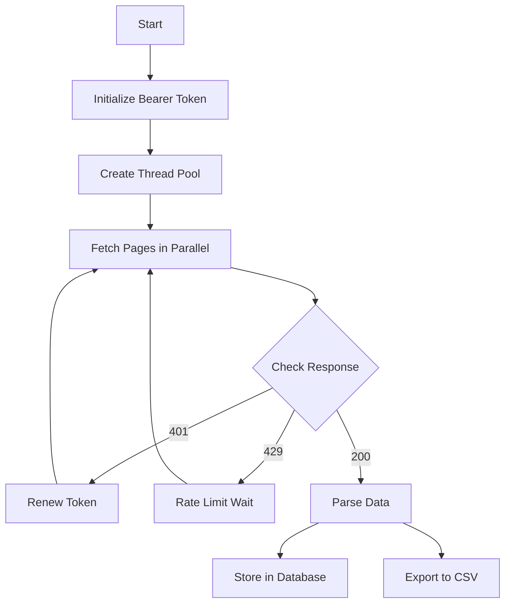

# Cielo Finance Data Scraper

This repository contains multiple implementations of a data scraping tool for Cielo Finance's leaderboard. The project includes Python and Go implementations, each with its own features and optimizations.

## Project Structure

```
cielo/
├── cielo_v1/          # Stable Python implementation with SQLite storage
├── cielo+go/          # Go implementation (experimental)
├── dev/               # Development files and data
└── db/               # Database utilities
```

## Version Comparison

### Python Version 1 (cielo_v1/)
- Production-ready implementation
- Features:
  - Multi-threaded data fetching
  - SQLite database storage
  - CSV export functionality
  - Rate limiting handling
  - Bearer token auto-renewal
  - Configurable parameters

### Python Version 2 (root directory)
- Enhanced implementation with Firebase integration
- Features:
  - Firebase Realtime Database integration
  - Multi-threaded data fetching
  - CSV export functionality
  - Improved error handling
  - Bearer token management

### Go Version (cielo+go/)
- Experimental implementation
- Features:
  - HTTP/3 support
  - JA3 fingerprint customization
  - High-performance networking

## Setup and Installation

### Python Versions (cielo_v1/ and root)

1. Create a virtual environment:
```bash
python -m venv venv
source venv/bin/activate  # On Unix/macOS
```

2. Install dependencies:
```bash
pip install -r requirements.txt
```

3. Configure credentials:
- Place your bearer token in `bearer_token.txt`
- For Firebase version: Add Firebase Admin SDK JSON file

### Go Version (cielo+go/)

1. Install dependencies:
```bash
go mod download
```

## Usage

### Python Version 1 (cielo_v1/)

1. Configure settings in `config.py`:
```python
NUM_PAGES = 100
NUM_THREADS = 10
API_URL = 'https://feed-api.cielo.finance/v1/leaderboard/tag'
```

2. Run the scraper:
```bash
python main.py
```

### Python Version 2 (root directory)

1. Set up Firebase:
- Place Firebase Admin SDK JSON in root directory
- Update database configuration in `db.py`

2. Run the scraper:
```bash
python app.py
```

### Go Version (cielo+go/)

1. Run the scraper:
```bash
go run main.go
```

## Data Flow



## Error Handling

The system implements robust error handling:
- Bearer token auto-renewal on 401 errors
- Rate limiting respect with dynamic wait times
- Exponential backoff for failed requests
- Connection pooling for database operations
- Thread-safe token management

## Data Storage

### SQLite (cielo_v1/)
- Local storage in `wallets.db`
- Efficient querying capabilities
- Transaction support

### Firebase (root version)
- Real-time database updates
- Cloud storage
- Scalable infrastructure

## Configuration

### Environment Variables
- `BEARER_TOKEN`: API authentication token
- `FIREBASE_CREDENTIALS`: Path to Firebase credentials (if using Firebase version)

### Parameters
- `NUM_THREADS`: Number of concurrent threads
- `NUM_PAGES`: Total pages to scrape
- `RATE_LIMIT_WAIT`: Base wait time for rate limiting

## Performance Optimization

- Multi-threaded data fetching
- Connection pooling
- Batch database operations
- Rate limit management
- Memory-efficient data processing

## Contributing

1. Fork the repository
2. Create your feature branch
3. Commit your changes
4. Push to the branch
5. Create a new Pull Request

## License

This project is licensed under the MIT License - see the LICENSE file for details.
