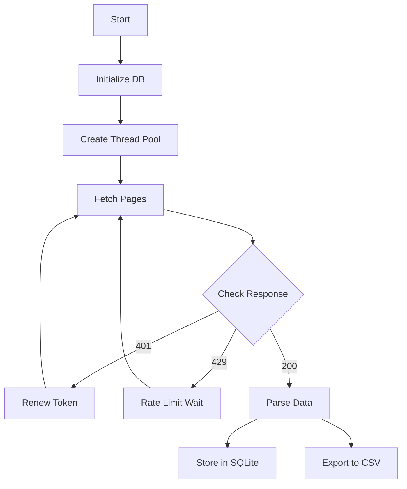

# Cielo Finance Scraper - Python V1

This is the stable Python implementation of the Cielo Finance leaderboard scraper with SQLite storage.

## Features

- Multi-threaded data fetching
- SQLite database integration
- CSV export functionality
- Robust error handling
- Rate limit management
- Bearer token auto-renewal

## Project Structure

```
cielo_v1/
├── api.py           # API interaction functions
├── config.py        # Configuration settings
├── database.py      # Database operations
├── main.py         # Main application logic
├── requirements.txt # Project dependencies
└── utils.py        # Utility functions
```

## Setup

1. Create a virtual environment:
```bash
python -m venv venv
source venv/bin/activate  # On Unix/macOS
```

2. Install dependencies:
```bash
pip install -r requirements.txt
```

3. Configure bearer token:
- Add your bearer token to `bearer_token.txt`

## Configuration

Edit `config.py` to adjust settings:

```python
NUM_PAGES = 100     # Number of pages to scrape
NUM_THREADS = 10    # Number of concurrent threads
API_URL = 'https://feed-api.cielo.finance/v1/leaderboard/tag'
```

## Data Flow



## Database Schema

The SQLite database (`wallets.db`) uses the following schema:

```sql
CREATE TABLE IF NOT EXISTS wallets (
    address TEXT PRIMARY KEY,
    roi_1d REAL,
    pnl_1d REAL,
    roi_7d REAL,
    pnl_7d REAL,
    roi_30d REAL,
    pnl_30d REAL,
    winrate REAL,
    bot INTEGER,
    tags TEXT
)
```

## Error Handling

- Bearer token renewal on 401 responses
- Rate limit respect with dynamic wait times
- Exponential backoff for failed requests
- Thread-safe operations
- Database transaction management

## Output

The scraper generates two types of output:
1. SQLite database entries in `wallets.db`
2. CSV files in the `dev/` directory with timestamps

## Monitoring

The application provides real-time console output showing:
- Thread status
- API response codes
- Rate limit information
- Error messages and retries
- Progress indicators

## Performance

- Concurrent page fetching
- Connection pooling for database
- Batch database operations
- Memory-efficient processing
- Rate limit management
